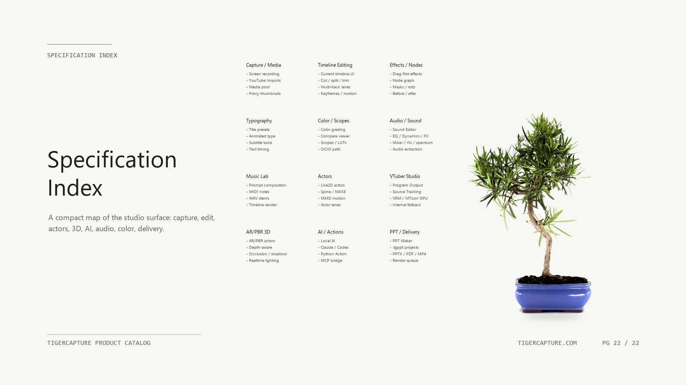

# TigerCapture

TigerCapture is a local-first creator studio for capture, video editing,
presentation production, 3D/AR compositing, audio work, VTuber workflows, MMD,
and AI-assisted review automation.

This public distribution repository contains release-safe product information,
catalog screenshots, and installer releases.

- Installer release: https://github.com/kuoungseok/tigercapture/releases/tag/v1.4.2
- Product catalog page: https://kuoungseok.github.io/tigercapture/

## Product Catalog Preview

The catalog screenshots below are shown directly in the repository root so the
public page can be scanned without opening each image link one by one.

  

|  |  |
|---|---|
|  02 Studio Surface |  03 AI Workflow |
|  04 PPT Maker |  05 Media Pool |
|  06 Timeline |  07 Effects |
|  08 Transitions |  09 Typography |
|  10 Keyframes |  11 Color |
|  12 Node Graph |  13 Node Effects |
|  14 Audio Workbench |  15 Audio Curves |
|  16 Live2D / Spine |  17 VRM |
|  18 MMD |  19 AR / PBR |
|  20 Creator Assist |  21 Export |
|  22 Closing |  |

## Current Public Build

- Installer: `TigerCapture-Setup-1.4.2.exe`
- SHA-256:
  `75EE94D571F23755D77AD5FC5107A4D583BBE2B4CD04C58C3BBA64C48ABA86BF`
- Platform: Windows x64
- Release asset delivery: GitHub Releases

## Product Spec Snapshot

TigerCapture is organized around a timeline-centered editor with specialist
workbenches around it:

- Capture and edit local video without cloud upload as the default path.
- Use media pool, timeline tracks, transitions, effects, typography, color, and
  audio workbench tools in one project.
- Build presentation pages with drag-and-drop media, video, 3D, and typography
  actors from the editor ecosystem.
- Render AR/PBR 3D objects over video, including depth-aware occlusion and
  preview/export parity targets.
- Work with Live2D, Spine, VRM/VTuber, and MMD actor workflows as editable
  timeline assets.
- Use Python Action / MCP-style structured actions so AI agents can inspect and
  operate editor features without scraping the UI.
- Generate review/catalog evidence from real editor screenshots and rendered
  proof outputs.

See the public spec summary:

- [docs/product_catalog/SPEC.md](docs/product_catalog/SPEC.md)

## License

See [LICENSE](LICENSE).
