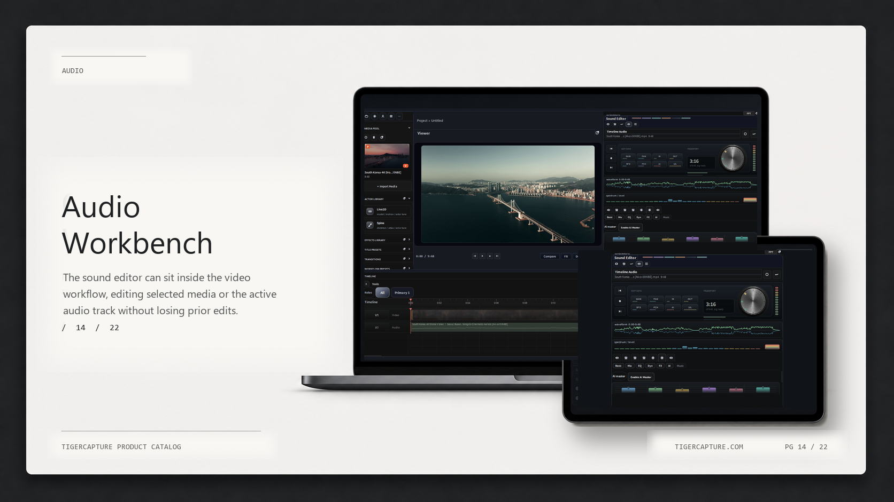
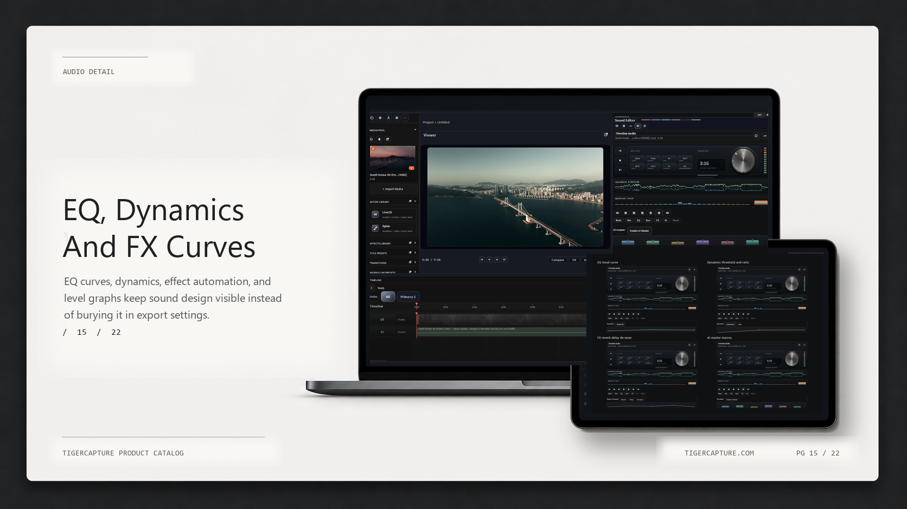
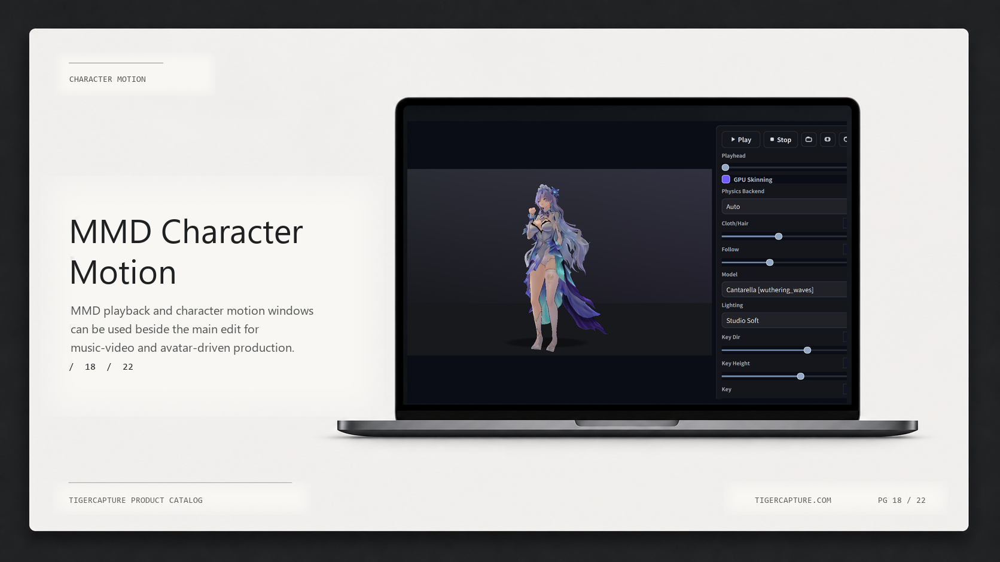
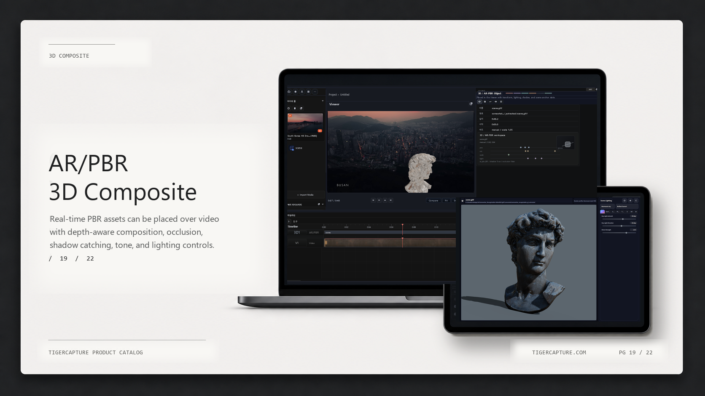
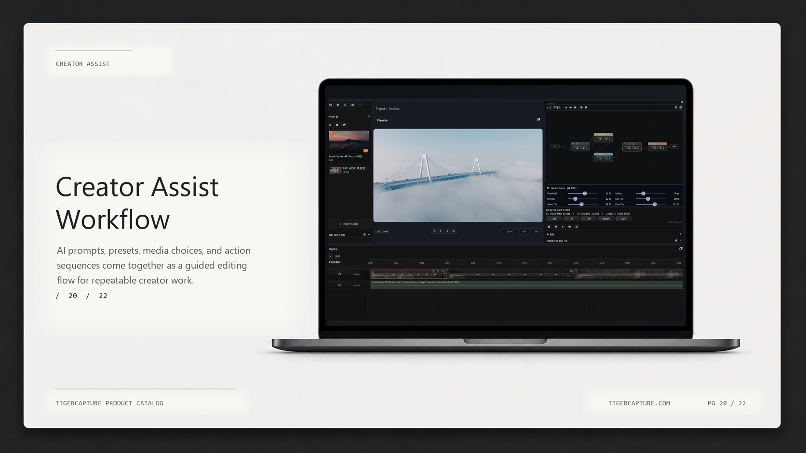
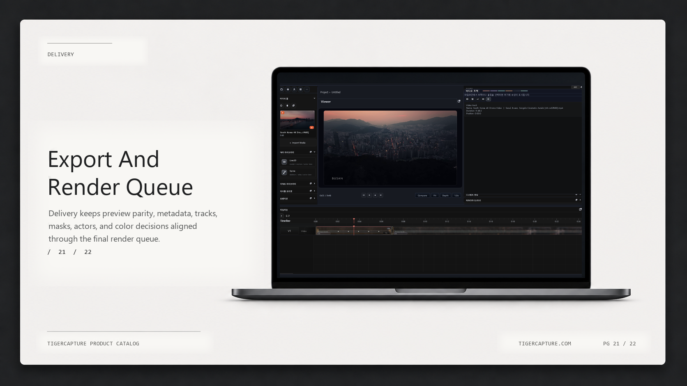

# Tiger Studio

**Subculture-ready video editor for screen, shorts, and character creators.**

Formerly TigerCapture. Local-first on Windows.

Made by **artmouse (KyoungSeok Ko)**.

화면녹화, 쇼츠 편집, Live2D/Spine/MMD/VRM 캐릭터, 음성, 음악, 발표 페이지를 한 프로젝트에서 다루는 로컬 우선 영상편집 스튜디오입니다.

- [Download installer](https://github.com/kuoungseok/tigercapture/releases/tag/v1.4.2)
- [View public spec](docs/product_catalog/SPEC.md)
- [Open product page](https://kuoungseok.github.io/tigercapture/)

## What You Can Make

| Output | What Tiger Studio helps with |
|---|---|
| **Polished screen recordings** | Screen Studio-style cursor, zoom, click, hotkey, and export polish. |
| **Character videos** | Live2D, Spine, MMD, and VRM actor tracks for edited videos and shorts. |
| **Shorts and social clips** | Captions, vertical templates, hooks, publish packages, and render queue handoff. |
| **Voice, music, and presentation videos** | Voice Lab direction, Music Lab, subtitles, and PPT-style pages. |

## Product Catalog Preview

The screenshots below are shown one large image at a time so the repository
front page reads like a product overview, not a folder of image links.

### Timeline Video Editor

### AI Workflow

### PPT / Presentation Pages

### Media Pool

### Timeline

### Effects and Transitions

### Typography and Keyframes

### Color and Node Workflows

### Audio, Voice, and Music Direction

### Character Actors

### AR / PBR / 3D Compositing

### Creator Assist and Export

## Positioning

Tiger Studio is not trying to replace DaVinci Resolve, CapCut, OBS, Live2D
Cubism, or VTube Studio directly. It brings the creator-facing parts together
into one local editing workflow.

Resolve급 전문 후반작업 툴이나 Cubism 같은 모델 제작툴을 대체하는 것이 아니라,
캐릭터와 화면녹화, 쇼츠, 음성, 음악을 하나의 영상편집 흐름으로 묶는 것이 핵심입니다.

## Current Status

- Final Product Readiness: 99/100, release claims still gated by real broadcast platform evidence.
- CapCut-style workflow: 89.38/100, cloud/mobile collaboration remains a gap.
- Descript-lite workflow: 88/100, scoped AI script edit value is claim-ready.
- NLE readiness: 91/100, not a Premiere/Resolve-class professional NLE claim.
- Character Asset Hub: local corpus scan supports Live2D/Spine assets strongly.
- Voice Lab: Style-Bert-VITS2 sidecar direction exists, but server/runtime readiness is sidecar-dependent.

## Current Public Build

- Installer: `TigerCapture-Setup-1.4.2.exe`
- SHA-256:
  `75EE94D571F23755D77AD5FC5107A4D583BBE2B4CD04C58C3BBA64C48ABA86BF`
- Platform: Windows x64

## License

See [LICENSE](LICENSE).
